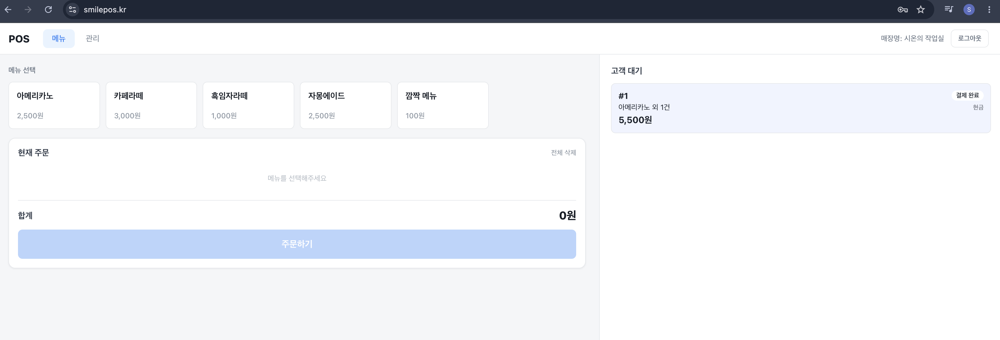
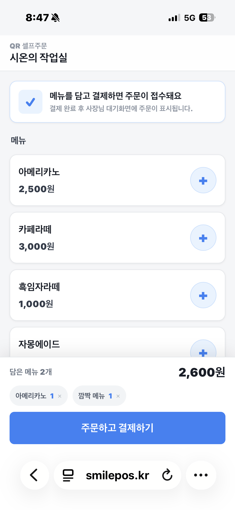

# POS SaaS

소상공인 매장에서 쓰는 웹 POS와 손님용 QR 셀프 주문 기능을 함께 제공한다. 한 매장에만 묶이지 않고 다른 매장에서도 같은 코드를 그대로 쓸 수 있도록 매장 단위로 데이터가 분리되는 멀티테넌트 구조로 설계했다.

사장님은 태블릿/PC 웹에서 메뉴를 관리하고 매장에서 주문을 받는다. 손님은 매장에 붙은 QR을 찍으면 모바일에서 메뉴를 보고 직접 주문·결제까지 끝낼 수 있다. 결제는 두 갈래로 나뉜다. 사장님이 POS에서 직접 처리하는 오프라인 결제(현금, 실물 카드)와, 손님이 셀프로 처리하는 간편결제(카카오페이/PortOne 연동).

## Screens

| 매장 POS (메뉴 선택·주문 접수·고객 대기) | 손님 QR 셀프 주문 (모바일) |
|:---:|:---:|
|  |  |

## Production

현재 운영 중:
- 매장 POS 페이지: `https://smilepos.kr` (로그인 필요)
- 손님 셀프 주문 페이지: `https://smilepos.kr/order/cafe-spring` (모바일용 샘플 페이지, 테스트 결제 가능)

## Architecture Highlights

📄 **[Case Study — 개발 의도 · 설계 의사결정 →](docs/portfolio/case-study.md)** 개발 의도와 주요 설계 의사결정은 별도 문서로 정리. 핵심만 요약하면:

- **멀티테넌트 격리** — storeId를 세션에서 파생, 단건 접근은 `id+storeId`로 묶어 IDOR/BOLA 차단
- **결제 정합성** — verify + 웹훅 이중화 + 조건부 UPDATE로 멱등 처리
- **주문번호 채번** — (매장, 날짜) 행 비관 락으로 동시 주문 직렬화

## Package Layout

도메인 코드는 4-layer 구조로 분리. 각 레이어 안에 도메인 패키지(`menu`, `order`, `payment`, `store`)로 한 단계 더 나뉜다.

```
com.sion.pos
├── config         # SecurityConfig, WebConfig
├── interfaces     # 외부 진입점 (REST API + Thymeleaf 페이지)
├── application    # Facade (트랜잭션 경계 + 비즈니스 조율)
├── domain         # 엔티티, 도메인 서비스, Repository 인터페이스
├── infrastructure # JPA Repository 구현체, 외부 API 어댑터
└── support        # 공통 (예외, PortOne 게이트웨이, 보안 헬퍼, 시간)
```

`config` / `support` 는 어느 레이어에도 속하지 않는 횡단 관심사.

## Stack

- **Language/Runtime**: Java 21, Spring Boot 3.4.4
- **Web/Persistence**: Spring Web, Spring Data JPA, Thymeleaf, Validation
- **Security**: Spring Security (세션 form login, BCrypt)
- **DB**: MySQL 8.4 + Flyway 마이그레이션
- **PG**: PortOne v2 (카카오페이 - PC IFRAME / 모바일 REDIRECTION)
- **Test**: JUnit5, Testcontainers (MySQL)
- **Build**: Gradle Kotlin DSL
- **Infra**: Docker Compose, EC2(Amazon Linux 2023), Nginx 리버스 프록시, Let's Encrypt HTTPS