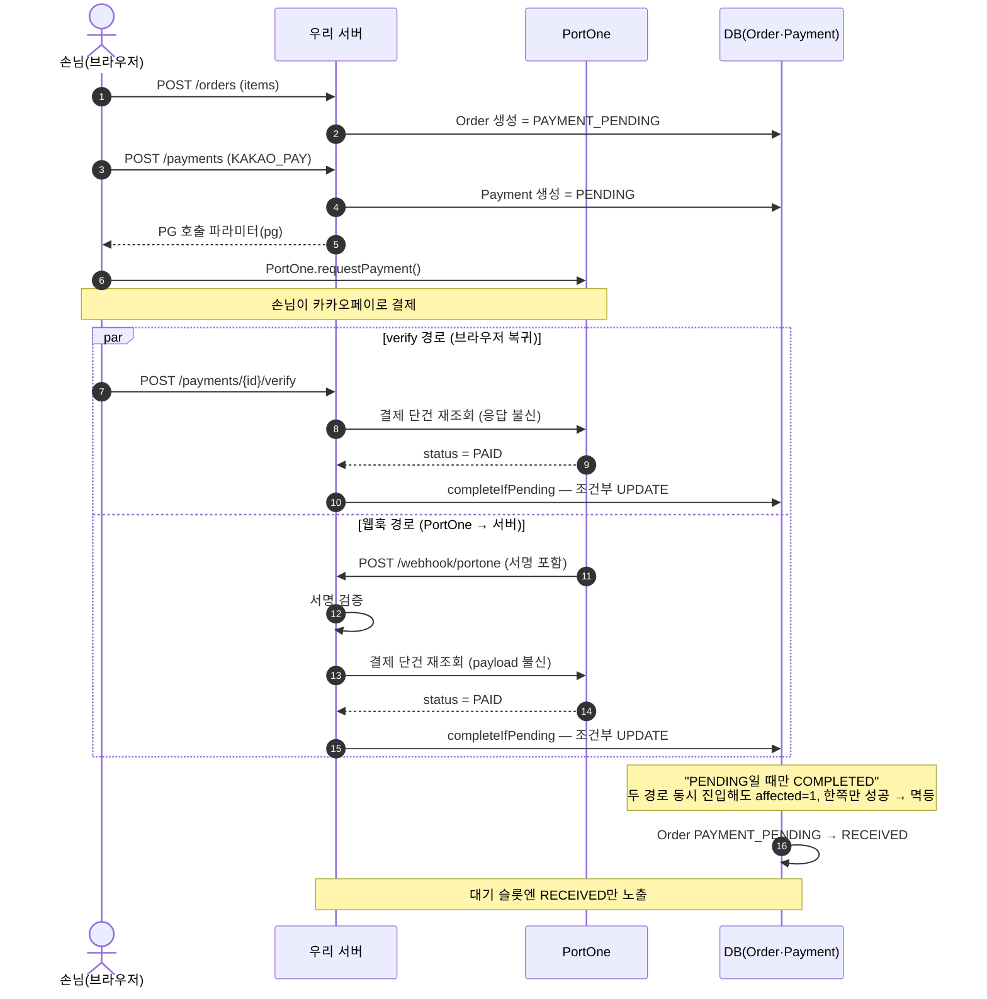
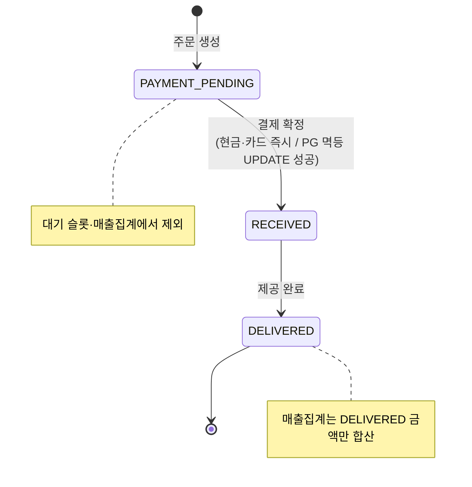

# 케이스 스터디 — 멀티테넌트 웹 POS + 손님 QR 셀프주문

> 혼자 설계·구현·배포·운영하는 웹 POS 서비스.
> 운영 도메인: https://smilepos.kr

---

## TL;DR

- **무엇** — 사장님은 태블릿/PC 웹 POS로 메뉴·주문·결제를 처리하고, 손님이 매장 QR을 찍어 모바일에서 직접 주문·결제할 수 있는 셀프 주문 페이지도 제공. 추후 여러 매장에서 사용할 수 있도록, 매장별 데이터가 분리되도록 설계.
- **왜** — 부모님 매장의 수기 주문 불편을 덜어드리려고 시작했다. 거기서 더 나아가 오프라인에서 온라인으로 이어지는 주문·결제 흐름을 직접 경험해보고 싶어, 간편결제와 손님 셀프주문 페이지까지 확장했다.
- **범위** — 도메인 모델링, 화면 UI, API, 인증/격리, 결제 연동, 인프라(EC2·Nginx·HTTPS), 배포까지 1인 개발.
- **핵심 설계** — ① PG 결제 정합성(verify + 웹훅 이중화 + 멱등 UPDATE) ② 멀티테넌트 격리(세션 파생 storeId, IDOR/BOLA 방어) ③ 동시 주문에서 안전한 주문번호 채번.

---

## 1. 배경과 문제

출발점은 부모님 매장의 **수기 주문**이었다. 노트와 펜으로 주문을 받다 보니 매번 메뉴를 일일이 받아적고, 총액을 손으로(또는 계산기로) 계산해야 했다. 지난 매출을 보거나 관리하기도 어려웠다. 이 불편을 없애드리고 싶어서 POS를 직접 만들기 시작했다.

그래서 푼 문제를 우선순위대로 정리하면:

1. **수기 주문의 디지털화 (핵심)** — 주문 항목·총액 자동 기록·계산, 매출 이력 조회·관리. 부모님 매장의 실제 페인을 없애는 것이 1차 목표.
2. **한 매장에 갇히지 않는 구조** — "우리 매장 전용"이 아니라, 다른 매장에 그대로 깔아도 데이터가 안전하게 분리되도록 설계.
3. **손님 QR 셀프주문 (확장 실험)** — POS의 결제 수단으로 QR 간편결제를 검토하다, 손님이 매장 QR로 모바일에서 직접 주문·결제까지 하는 흐름까지 확장해봤다. PG 심사를 통과해 실결제까지 동작하지만, 매장 손님 구성상 실사용은 거의 없는 상태다.

---

## 2. 무엇을 만들었나

| 사용자 | 화면/기능 |
|---|---|
| 사장님(매장) | 로그인 → 메뉴 관리, 주문 접수, 결제(현금·실물카드 즉시 / 손님 셀프결제 결과 확인), 대기 주문 현황, 일별 매출 집계 |
| 손님 | QR → 모바일 메뉴 → 장바구니 → 주문 → 카카오페이 셀프결제 → 주문 접수 |

결제는 두 갈래다.
- **오프라인 결제** — 사장님이 POS에서 현금/실물카드로 즉시 완료 처리.
- **간편결제** — 손님이 셀프로 카카오페이(PortOne) 결제.

---

## 3. 핵심 설계

### ① PG 결제 정합성

손님 셀프결제는 외부 PG와 비동기로 결제 결과를 주고받는 흐름이라, 결제 상태 정합성이 가장 중요한 문제라고 생각했다.

#### (1) 클라이언트 응답을 믿지 않는다 — 서버 verify

PG 결제 성공 여부는 브라우저가 받은 응답으로 판단하지 않는다. 결제 상태는 **항상 서버가 PortOne API를 재조회해 확정한 값**을 기준으로 한다.

흐름: 브라우저 → 우리 서버 → PortOne 단건 재조회 → DB UPDATE.

#### (2) verify + 웹훅 이중화, 그리고 멱등 UPDATE

같은 결제 한 건에 대해 **verify(브라우저 경유)** 와 **웹훅(PortOne → 우리 서버)** 두 경로가 동시에 들어올 수 있다. 경합이 생긴다.

- 상태 전이를 `"현재 PENDING일 때만 COMPLETED로 바꾼다"`는 **조건부 native UPDATE**(`completeIfPending` / `failIfPending`)로 처리.
- 두 경로가 동시에 들어와도 DB가 한쪽만 성공시키므로(affected row = 1) 후속 처리는 정확히 한 번만 일어난다. → 멱등성 확보.
- 웹훅은 **서명 검증을 통과해도 페이로드를 믿지 않고** PortOne 재조회로 다시 확인한다.

#### (3) "통신 오류"와 "결제 실패"를 구분한다

verify HTTP 호출이 실패한 것(응답 유실)은 **결제 실패가 아니다.** 손님이 실제로 결제에 성공했는데 응답만 못 받았을 수 있다. 이걸 "실패"로 단정하면 사장님이 손님에게 재결제를 요구 → **이중청구**. 그래서 PortOne이 명시적으로 `FAILED`라고 한 경우와 통신 오류(catch)를 분리하고, 후자는 확정하지 않은 채 **주문번호와 함께 직원 확인을 안내**한다. (ADR 0006)

문구는 *"확인 중"* 이 아니라 *"확인이 필요해요"* 로 쓴다. 화면이 스스로 갱신되지 않는 상태에서 "확인 중"이라고 쓰면 곧 풀릴 것처럼 읽혀 거짓말이 된다.

#### 흐름 한눈에 — verify·웹훅 경합이 멱등으로 수렴

핵심은 **두 경로가 동시에 들어와도 후속 처리는 정확히 한 번**이라는 것. 이 멱등성을 애플리케이션 락이 아니라 DB의 조건부 UPDATE로 처리했다.

#### 정합성 범위를 어디까지 — PAYMENT_PENDING 상태머신

주문 생성 시점을 `PAYMENT_PENDING`으로 두고, **결제가 확정돼야 `RECEIVED`로 승격**되어 사장님 대기 슬롯에 노출된다. 현금/카드는 즉시 승격, PG는 verify/웹훅 멱등 UPDATE 성공 시 승격. 결제가 안 된 주문이 접수된 것처럼 보이는 상태를 막기 위한 구분이다.

### ② 멀티테넌트 격리

한 매장이 다른 매장의 메뉴/주문/결제를 볼 수 없어야 한다. 여러 매장이 같은 코드·DB를 공유하는 구조라, 격리가 철저히 지켜지지 않으면 데이터가 섞여 복구가 어려운 치명적인 사고가 될 수 있다.

- **storeId는 클라이언트가 정하지 않는다** — 처음엔 `X-Store-Id` 헤더 / `?storeId=` 방식이었지만 폐기. 어떤 매장의 요청인지는 **인증된 세션에서 서버가 결정**한다(`LoginStore` ArgumentResolver). 클라이언트가 보낸 값으로 매장을 판단하면 `?storeId=2`로 남의 매장을 조회할 수 있다.
- **단건 접근은 매장 ID와 묶는다** — `findByIdAndStoreId` / `deleteByIdAndStoreId`. 목록 필터링만 걸어두면 자원 ID만 추측해 다른 매장 데이터를 건드리는 공격(IDOR / BOLA)을 막을 수 없다. 그래서 상세·수정·삭제를 전부 매장 ID와 함께 처리.
- **기본은 default-deny** — `anyRequest authenticated` + 공개 화이트리스트(`/login`, 정적 자산, 웹훅)만 예외. 손님 공개 API는 path variable로 storeId를 받되 노출 가능한 자원 범위만 응답.

### ③ 동시 주문에서 안전한 주문번호 채번

주문번호는 매장마다 매일 1번부터 새로 매긴다. 이를 위해 (매장, 날짜) 조합마다 한 행을 갖는 채번 테이블을 따로 둔다. 단순 `MAX+1`도 고려했으나, 두 주문이 동시에 들어오면 같은 번호가 나오는 중복 채번 위험이 있다. 그래서 그 채번 행에 비관 락을 걸어 직렬화했다. 행 단위 락이라 다른 매장·다른 날짜끼리는 경합하지 않고, 동시 주문 회귀 테스트로 확인했다.

---

## 4. 현황

- 2026-06-02부터 부모님 매장에서 실사용 중. 첫날 함께 주문을 받으며 확인했고, 현재까지 매장에서 사용 중.
- 라이브: `https://smilepos.kr` · 손님 셀프주문 데모: `https://smilepos.kr/order/cafe-spring` (로그인 없이 QR 플로우 확인 가능)
- 카카오페이 간편결제는 **심사를 통과해 실결제까지 동작한다.** 다만 매장 손님 구성상 셀프 주문 실사용은 거의 없다. **데모 매장도 실결제 채널**이라 결제를 끝까지 진행하면 실제로 청구된다.

### 별도 브랜치에서 진행한 작업 (운영 미반영)

단일 매장·단일 인스턴스에는 필요하지 않지만, 트래픽과 인스턴스가 늘었을 때를 가정해 따로 진행한 것들이다. 운영에는 반영하지 않았다.

**동시 요청과 이벤트 전달**

- **한정 수량 메뉴** — 조건부 UPDATE로 초과 판매 차단. 하루 100개 한정 메뉴에 300건을 넣어 100건 성공 / 200건 `OUT_OF_STOCK` 거절 확인
- **채번 락 범위 축소** — 부하 테스트로 병목이 재고가 아니라 주문번호 채번 락임을 확인. 한 주문에 담긴 메뉴가 많을수록 락을 오래 쥐던 구조를 별도 트랜잭션으로 분리해 메뉴 수와 무관하게 만듦. 항목 1개 +42%, 5개 +85%
- **주문 이벤트 전달 (Outbox + Kafka)** — 발행 유실과 중복 소비를 각각 다른 층에서 차단
- **전국 매장 매출 순위 (Redis ZSET)** — 커밋 이후 갱신하고 실패분은 주기적 보정으로 복구

**인스턴스가 여러 대일 때**

- **스케줄러 단독 실행 (Redis 분산 락)** — 매출 순위 보정 배치가 인스턴스마다 중복 실행되는 문제를 락으로 제어
- **계정 단위 강제 로그아웃 (Redis 세션 외부화)** — 인스턴스마다 세션을 따로 들고 있어 한쪽에서 지워도 다른 쪽은 로그인이 유지되던 문제. 무상태 토큰(remember-me)이 폐기된 세션을 되살리는 경로도 함께 차단
- **대기 목록 실시간 전파 (SSE + Redis pub/sub)** — 3초 폴링을 SSE로 전환. 알림이 그 주문을 처리한 인스턴스에만 가서 다른 인스턴스에 연결된 화면은 갱신되지 않던 문제를 pub/sub으로 해결